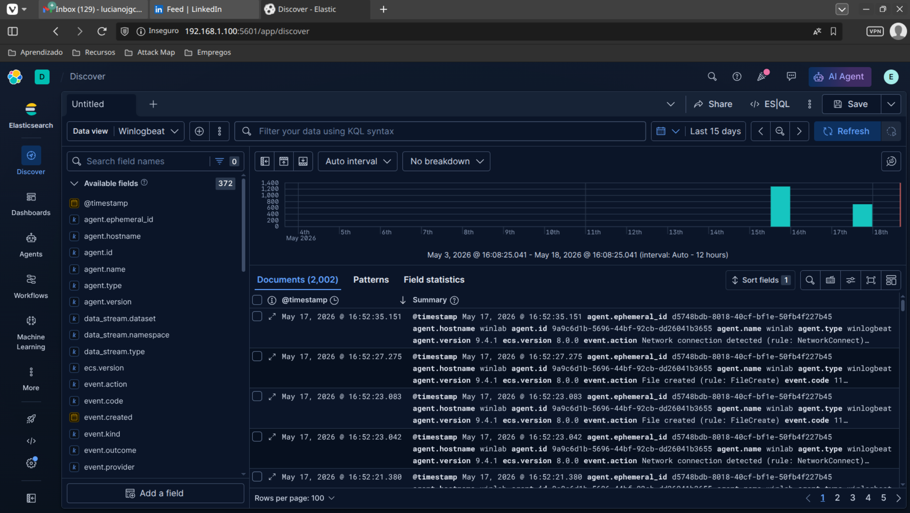
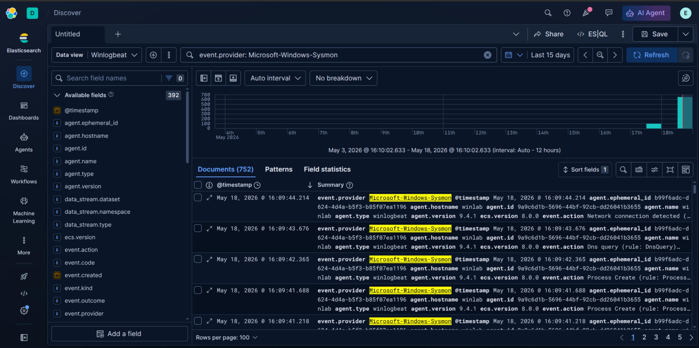
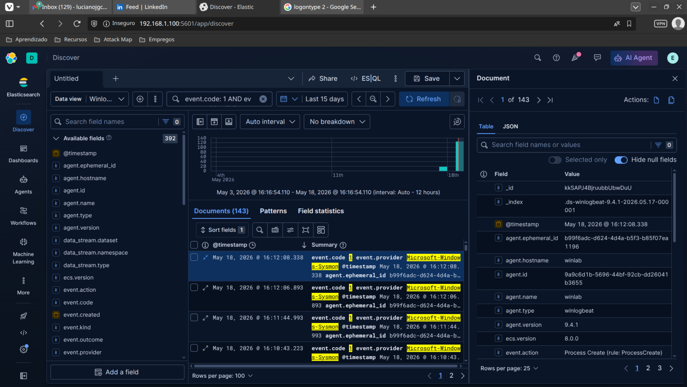
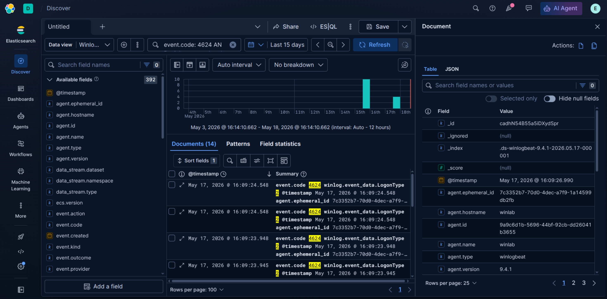
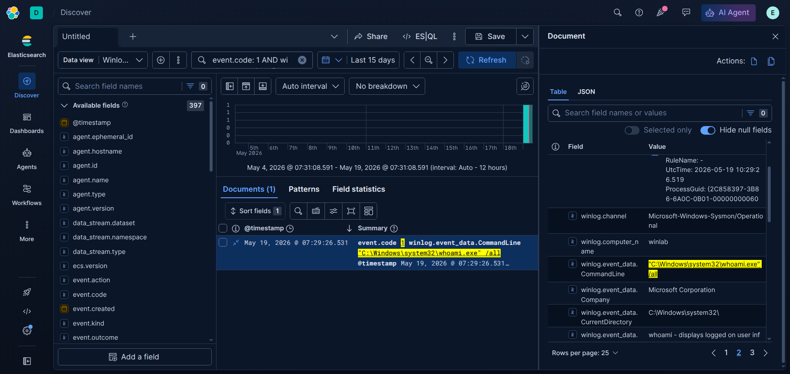
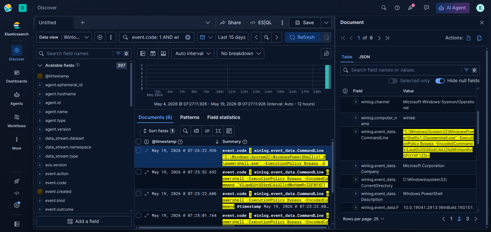
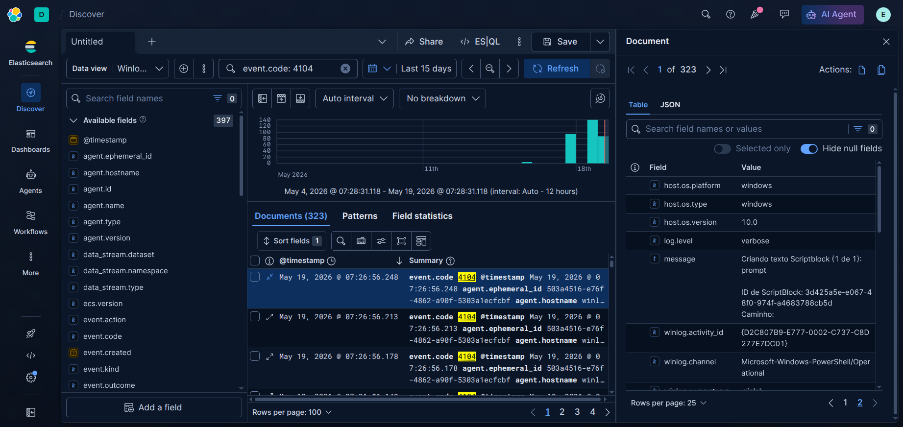
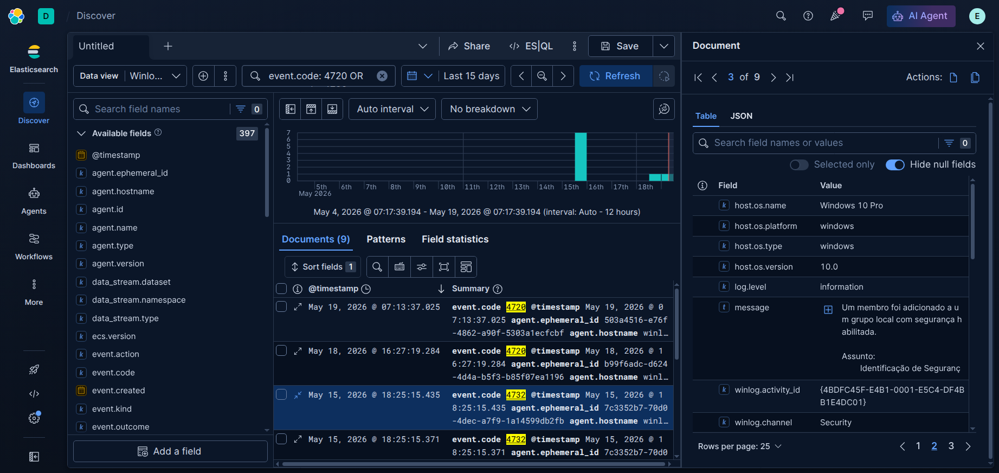
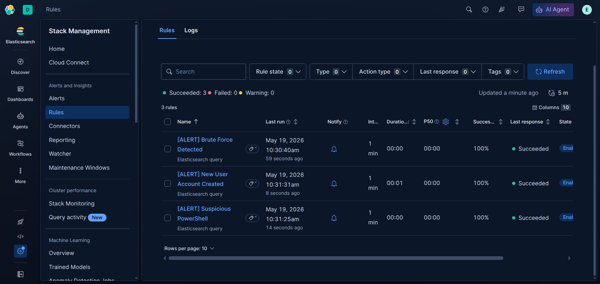
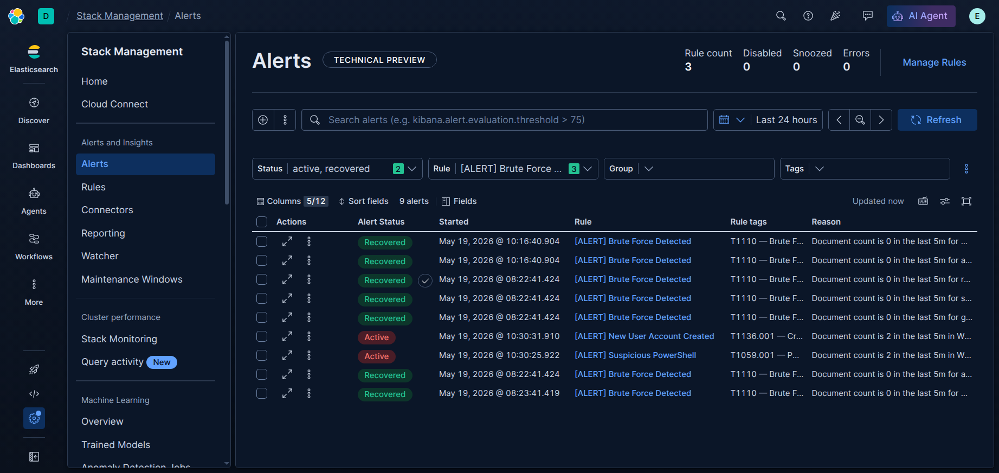

# 🔍 ELK Stack Home Lab — SIEM & Threat Detection

> Home lab completo de detecção de ameaças com ELK Stack, Sysmon e Winlogbeat.  
> Simulação de ataques reais categorizados por MITRE ATT&CK, com alertas automáticos e dashboards no Kibana.

---

## 📋 Índice

- [Arquitetura](#arquitetura)
- [Stack Tecnológica](#stack-tecnológica)
- [Configuração do Ambiente](#configuração-do-ambiente)
- [Coleta de Logs](#coleta-de-logs)
- [Cenários de Ataque Simulados](#cenários-de-ataque-simulados)
- [Dashboards](#dashboards)
- [Alertas Automáticos](#alertas-automáticos)
- [Queries KQL de Referência](#queries-kql-de-referência)
- [Estrutura do Repositório](#estrutura-do-repositório)

---

## Arquitetura

O lab é composto por **3 máquinas físicas/virtuais** na mesma rede local:

```
┌────────────────────────────────────────────────────────────┐
│                     REDE LOCAL (192.168.1.x)               │
│                                                            │
│  ┌─────────────────┐         ┌──────────────────────────┐  │
│  │  Ubuntu (PC)    │         │  Ubuntu Server           │  │
│  │  Máquina        │         │  ELK Host                │  │
│  │  Principal      │◀───────▶│                          │  │
│  │                 │         │  • Elasticsearch         │  │
│  │  • Kibana UI    │         │  • Kibana                │  │
│  │  • Operação     │         │  • elastic-start (local) │  │
│  │  • Hunting      │         │                          │  │
│  └─────────────────┘         └──────────────────────────┘  │
│              │                                             │
│   ┌──────────▼───────────────┐                             │
│   │  Windows 10 VM           │                             │
│   │  (WINLAB)                │                             │
│   │                          │                             │
│   │  • Winlogbeat 9.4.1      │                             │
│   │  • Sysmon                │                             │
│   │  • Elastic Agent         │                             │
│   │  → envia logs ao ELK     │                             │
│   └──────────────────────────┘                             │
└────────────────────────────────────────────────────────────┘
```

---

## Stack Tecnológica

| Componente | Versão | Função |
|---|---|---|
| Elasticsearch | 8.x | Armazenamento e indexação de logs |
| Kibana | 8.x | Visualização, SIEM e alertas |
| Winlogbeat | 9.4.1 | Coleta e envio de logs Windows → ELK |
| Sysmon | Latest | Telemetria avançada de processos, rede e registro |
| Ubuntu (PC) | 22.04 LTS | Máquina principal — operação e acesso ao Kibana |
| Ubuntu Server | 22.04 LTS | Host do stack ELK via `elastic-start` local |
| Windows 10 Pro | 10.0.19041 | Endpoint monitorado — `WINLAB` |

---
## Configuração do Ambiente

### Ubuntu Server — ELK Host

O stack foi iniciado utilizando o script oficial `start-local` da Elastic, executado via Docker Compose para ambiente local de desenvolvimento e testes.

```bash
# Baixar e iniciar Elasticsearch + Kibana
curl -fsSL https://elastic.co/start-local | sh
```

Após a execução do script, os serviços ficam disponíveis nos seguintes endpoints:

```bash
# Elasticsearch
http://<ip-servidor>:9200

# Kibana
http://<ip-servidor>:5601
```

> O Kibana é acessado pelo Ubuntu principal via navegador na rede local (`192.168.1.100:5601`).

> Este ambiente foi configurado apenas para fins de laboratório/homelab, conforme recomendado pela documentação oficial da Elastic.

---

### Windows 10 — Endpoint Monitorado (WINLAB)

#### Sysmon

```powershell
# Instalação com config SwiftOnSecurity (recomendada)
.\Sysmon64.exe -accepteula -i sysmonconfig.xml
```

Eventos capturados pelo Sysmon:

| Event ID | Descrição |
|---|---|
| 1 | Process Create |
| 3 | Network Connection |
| 10 | Process Access (LSASS) |
| 11 | File Create |
| 13 | Registry Value Set |
| 22 | DNS Query |

#### Winlogbeat

```powershell
# Setup e início do serviço
.\winlogbeat.exe setup -e
Start-Service winlogbeat
```

Canais monitorados via `winlogbeat.yml`:

```yaml
winlogbeat.event_logs:
  - name: Security
  - name: Microsoft-Windows-Sysmon/Operational
  - name: Microsoft-Windows-PowerShell/Operational
  - name: System
  - name: Application
```

---

## Coleta de Logs

### Pipeline de Dados

```
Windows 10 (WINLAB)
  └─ Sysmon → canal Sysmon/Operational
  └─ Windows Security Log → canal Security
  └─ PowerShell → canal PowerShell/Operational
       │
       ▼
  Winlogbeat 9.4.1
       │
       ▼ (porta 5044 / direct output)
  Elasticsearch
       │
       ▼
  Kibana Discover / SIEM / Alertas
```

### Dashboards de Coleta

#### Winlogbeat — Visão Geral

Visão geral de todos os eventos coletados — 2.002 documentos na janela de 15 dias, com picos nos dias de simulação de ataque:



#### Sysmon — Eventos Filtrados

752 documentos com `event.provider: Microsoft-Windows-Sysmon` — processos, conexões de rede e consultas DNS:



#### Sysmon Event Code 1 — Process Create

143 eventos de criação de processo capturados pelo Sysmon no host `winlab`:



#### Event 4624 — Login Bem-sucedido

14 eventos de logon interativo (LogonType 2) registrados no canal Security:



---

## Cenários de Ataque Simulados

Todos os ataques foram executados manualmente no endpoint **WINLAB** e detectados via Kibana. As técnicas são mapeadas ao framework **MITRE ATT&CK**.

---

### 1. Reconhecimento — `whoami /all`

**MITRE ATT&CK:** [T1033](https://attack.mitre.org/techniques/T1033/) — System Owner/User Discovery

O atacante executa `whoami /all` logo após o acesso inicial para enumerar o usuário atual, grupos de segurança e privilégios do sistema.

**Query KQL usada:**
```kql
event.code: 1 AND winlog.event_data.CommandLine: *whoami*
```

**Evidência:**



> O Sysmon (Event ID 1) registrou a execução de `"C:\Windows\system32\whoami.exe" /all` no host `winlab` em `2026-05-19 @ 07:29:26.531`. Apenas 1 documento encontrado — execução pontual e cirúrgica.

---

### 2. Brute Force — Event 4625

**MITRE ATT&CK:** [T1110](https://attack.mitre.org/techniques/T1110/) — Brute Force

Múltiplas tentativas de autenticação com credenciais inválidas contra a máquina Windows, gerando sequência de eventos 4625 no Security Log.

**Queries KQL usadas:**
```kql
# Todas as falhas
event.code: 4625

# Filtrado por usuário
event.code: 4625 AND winlog.event_data.TargetUserName: "Administrator"

# Senha incorreta (SubStatus 0xc000006a)
event.code: 4625 AND winlog.event_data.SubStatus: "0xc000006a"

# Usuário inexistente (SubStatus 0xc0000064)
event.code: 4625 AND winlog.event_data.SubStatus: "0xc0000064"
```

> 📷 Evidências:
> - Eventos individuais: [`screenshots/attacks/brute-force/event-code-4625.png`](screenshots/attacks/brute-force/event-code-4625.png)
> - Top usuários afetados: [`screenshots/attacks/brute-force/table-top-users-4625.png`](screenshots/attacks/brute-force/table-top-users-4625.png)

---

### 3. PowerShell com EncodedCommand

**MITRE ATT&CK:** [T1059.001](https://attack.mitre.org/techniques/T1059/001/) — PowerShell | [T1027](https://attack.mitre.org/techniques/T1027/) — Obfuscated Files or Information

Execução de PowerShell com flags `-ExecutionPolicy Bypass -EncodedCommand <base64>`, técnica clássica para evasão de políticas de execução e ofuscação de payloads.

**Query KQL usada:**
```kql
event.code: 1 AND process.name: "powershell.exe" AND (
    winlog.event_data.CommandLine: *EncodedCommand* OR
    winlog.event_data.CommandLine: *Bypass*
)
```

**Evidência:**



> O Sysmon registrou **6 execuções** de `powershell.exe -ExecutionPolicy Bypass -EncodedCommand V3JpdGUtSG9zdCAiAiU2ltdWxhbmRvIGF0YXF1ZSI=` no host `winlab`. O campo `CommandLine` destacado em amarelo evidencia a presença do payload base64.

---

### 4. Script Block Logging — Event 4104

**MITRE ATT&CK:** [T1059.001](https://attack.mitre.org/techniques/T1059/001/) — PowerShell

O PowerShell Script Block Logging captura o conteúdo real dos scripts executados, mesmo quando ofuscados. Complementa o Event ID 1 do Sysmon com o conteúdo completo do bloco executado.

**Query KQL usada:**
```kql
event.code: 4104
```

**Evidência:**



> **323 documentos** capturados no canal `Microsoft-Windows-PowerShell/Operational`. O detalhe do documento exibe `log.level: verbose` e a mensagem `Criando texto Scriptblock (1 de 1): prompt`, confirmando que o conteúdo do script foi registrado.

---

### 5. Backdoor — Criação de Usuário e Escalada de Privilégio

**MITRE ATT&CK:** [T1136.001](https://attack.mitre.org/techniques/T1136/001/) — Create Local Account | [T1098](https://attack.mitre.org/techniques/T1098/) — Account Manipulation

Criação de um novo usuário local (Event 4720) seguida da adição ao grupo de administradores locais (Event 4732), estabelecendo persistência com privilégios elevados.

**Queries KQL usadas:**
```kql
# Usuário criado
event.code: 4720

# Adicionado ao grupo admin
event.code: 4732

# Combinado (timeline do backdoor)
event.code: 4720 OR event.code: 4732
```

**Evidência:**



> O Discover exibe **9 documentos** com eventos 4720 e 4732. O painel lateral confirma `host.os.name: Windows 10 Pro`, canal `Security` e a mensagem `Um membro foi adicionado a um grupo local com segurança habilitada`, mapeando exatamente a sequência criação → escalada.

> 📷 Também disponível: [`screenshots/attacks/backdoor/windows-ps-exec.png`](screenshots/attacks/backdoor/windows-ps-exec.png)

---

## Dashboards

| Dashboard | Descrição | Screenshot |
|---|---|---|
| Default — Winlogbeat | Visão geral de todos os eventos | [`dashboard-default.png`](screenshots/dashboard/dashboard-default.png) |
| Sysmon Events | Eventos filtrados do Sysmon | [`dashboard-sysmon.png`](screenshots/dashboard/dashboard-sysmon.png) |
| Sysmon Event Code 1 | Process Create | [`sysmon_event-code-1.png`](screenshots/dashboard/sysmon_event-code-1.png) |
| Event 4624 | Logins bem-sucedidos | [`event-code-4624.png`](screenshots/dashboard/event-code-4624.png) |

---

## Alertas Automáticos

3 regras de detecção configuradas no Kibana Stack Management → Rules, todas do tipo **Elasticsearch query**, rodando a cada **1 minuto**.



| Regra | MITRE | Estado |
|---|---|---|
| [ALERT] Brute Force Detected | T1110 | ✅ Succeeded |
| [ALERT] New User Account Created | T1136.001 | ✅ Succeeded |
| [ALERT] Suspicious PowerShell | T1059.001 | ✅ Succeeded |

### Alertas Disparados



> Na janela de 24h, os alertas **New User Account Created** e **Suspicious PowerShell** aparecem como `Active` (disparados no momento do ataque), enquanto os de **Brute Force** retornam `Recovered` após cessarem as tentativas — comportamento esperado e correto.

---

## Queries KQL de Referência

O arquivo [`queries/useful-kql.md`](queries/useful-kql.md) contém todas as queries organizadas por categoria:

| Categoria | Exemplos |
|---|---|
| **Login / Autenticação** | 4624, 4625, 4648, 4740, 4776 |
| **Processos (Sysmon)** | Event 1 — cmd, powershell, LOLBins |
| **Reconhecimento** | whoami, net user, ipconfig, netstat |
| **Persistência** | 4720, 4732 — criação de usuário e grupo |
| **Rede (Sysmon)** | Event 3 — HTTP, HTTPS, IPs externos |
| **Arquivos** | Event 11 — .exe em Temp |
| **Registro** | Event 13 — Run Key |
| **PowerShell Logging** | Event 4104 — Invoke-WebRequest, OutFile |
| **LSASS / Credential Dump** | Event 10 — acesso ao lsass.exe |
| **LOLBins** | certutil, mshta, rundll32, regsvr32 |

---

## Estrutura do Repositório

```
elk-stack-home-lab/
│
├── architecture/
│   └── soc_diagram.png               # Diagrama da arquitetura do lab
│
├── queries/
│   └── useful-kql.md                 # Queries KQL organizadas por categoria
│
└── screenshots/
    ├── alerts/
    │   ├── alerts-rules.png           # Regras de alerta configuradas
    │   └── alerts-working.png         # Alertas disparados em produção
    │
    ├── attacks/
    │   ├── backdoor/
    │   │   ├── event-4720-event-4732.png   # Criação de usuário + escalada
    │   │   └── windows-ps-exec.png          # Execução via PS no Windows
    │   ├── brute-force/
    │   │   ├── event-code-4625.png          # Falhas de login
    │   │   └── table-top-users-4625.png     # Top usuários atacados
    │   ├── encoded-powershell/
    │   │   ├── event-1-and-encoded.png      # Sysmon + EncodedCommand
    │   │   └── event-4104.png               # Script Block Logging
    │   └── reconhecimento/
    │       └── event-code-1-whoami.png      # whoami /all capturado
    │
    └── dashboard/
        ├── dashboard-default.png            # Visão geral Winlogbeat
        ├── dashboard-sysmon.png             # Eventos Sysmon
        ├── event-code-4624.png              # Logins bem-sucedidos
        └── sysmon_event-code-1.png          # Process Create
```

---

## Referências

- [MITRE ATT&CK Framework](https://attack.mitre.org/)
- [Elastic SIEM Documentation](https://www.elastic.co/guide/en/security/current/index.html)
- [SwiftOnSecurity Sysmon Config](https://github.com/SwiftOnSecurity/sysmon-config)
- [Winlogbeat Reference](https://www.elastic.co/guide/en/beats/winlogbeat/current/index.html)
- [Kibana KQL Syntax](https://www.elastic.co/guide/en/kibana/current/kuery-query.html)